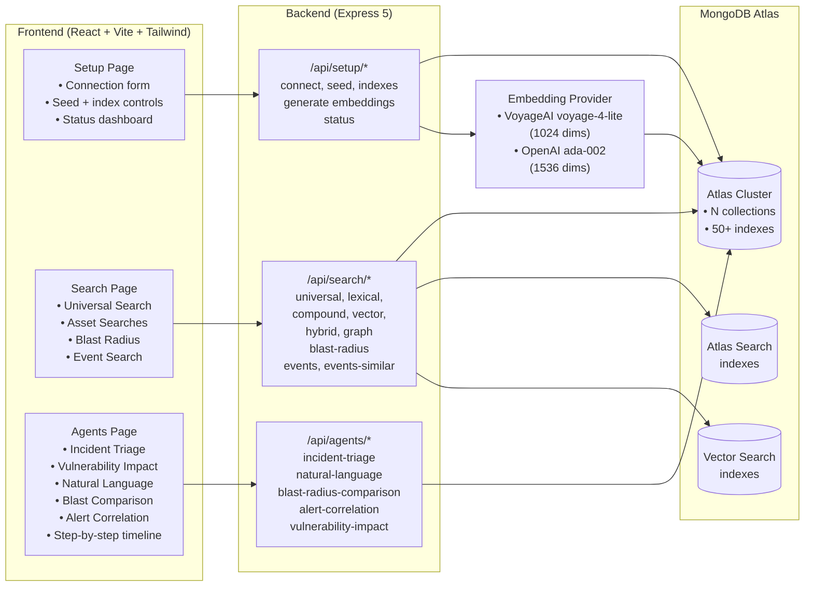

# Architecture — [Project Name] POC

## Scope

- **Use case:** <!-- One sentence: what MongoDB capabilities does this demo highlight? -->
- **Workload:** <!-- e.g. Read-heavy search; bursty writes on seed/demo inserts; ~N documents -->
- **Audience:** <!-- e.g. Mixed technical/business — value-first UI with optional query transparency panels -->

## Component Map

| Component | Atlas service/product | Responsibility |
|-----------|----------------------|----------------|
| Primary data store | **Atlas Cluster** | CRUD, filters, aggregation pipelines |
| Full-text search | **Atlas Search** | <!-- fields being searched --> |
| Semantic search | **Atlas Vector Search** | <!-- embedding field + model --> |
| Demo UI | React + Vite + Tailwind | Tabbed SPA — Setup, Search, Agents pages |
| API layer | Express 5 | REST routes serving the frontend |
| Embedding provider | <!-- VoyageAI / OpenAI --> | <!-- model name + dimensions --> |

## Standard Page Layout

| Page | Routes | Purpose |
|------|--------|---------|
| Setup | `/api/setup/*` — connect, seed, indexes, embeddings, status | One-time environment bootstrap |
| Search | `/api/search/*` — universal, lexical, vector, hybrid, compound, graph | Showcase search breadth |
| Agents | `/api/agents/*` — triage, natural-language, blast-radius, alert-correlation | AI-assisted workflows |

## Non-MongoDB Dependencies

| Dependency | Why needed | Atlas alternative | Decision |
|------------|------------|-------------------|----------|
| React + Vite + Tailwind | Branded demo SPA | None for UI | MongoDB-aligned styling |
| Express 5 | Lightweight API layer | None | Separate `backend/` from `frontend/` |
| TypeScript | Shared types, scripts | — | Root + both packages |
| <!-- Embedding SDK --> | Vector generation | None | <!-- e.g. `@voyageai/client` --> |

## Diagram

## Trade-Offs

- **Embedding provider:** <!-- Why this model/provider? Latency vs quality vs cost. -->
- **Vector index:** <!-- Dimensions, similarity metric (cosine/dotProduct), numCandidates choice. -->
- **Search strategy:** <!-- When to use lexical vs vector vs hybrid — document the decision. -->
- <!-- Add any SSE, streaming, or real-time trade-offs if applicable. -->

## Hard Gate Approval

- **Approval:** <!-- "Plan approved — implement as specified (YYYY-MM-DD)" or "Pending" -->
- **Logged in `gates.md`:** <!-- Yes / No -->
