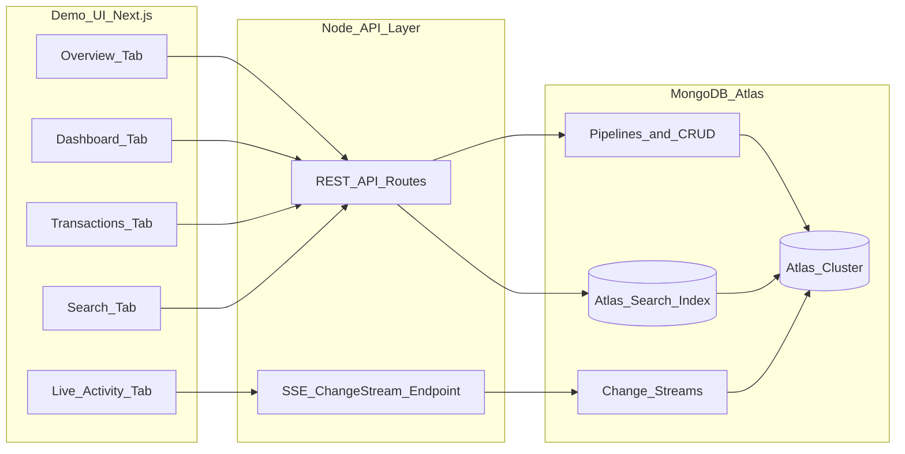

# Architecture — Personal Finance Transaction Tracker POC

## Scope

- **Use case:** Demo personal finance app showcasing Atlas Cluster CRUD/aggregations, Atlas Search, and Change Streams.
- **Workload:** Read-heavy dashboard; bursty writes on demo inserts; ~15k transaction documents.
- **Audience:** Mixed technical/business — value-first UI with optional MQL transparency panels.

## Component Map

| Component | Atlas service/product | Responsibility |
|-----------|----------------------|----------------|
| Transaction store | **Atlas Cluster** | CRUD, filters, aggregation pipelines |
| Full-text lookup | **Atlas Search** | Query `merchant`, `description`, `tags` |
| Live activity feed | **Change Streams** | SSE push on `transactions` collection |
| Demo UI | Next.js 15 (external) | Tabbed dashboard, API routes, EventSource client |

## Non-MongoDB Dependencies

| Dependency | Why needed | Atlas alternative | Decision |
|------------|------------|-------------------|----------|
| Next.js 15 | SPA + API routes + SSE | None for UI | Use App Router under `frontend/` |
| React + Tailwind | Branded demo UI | None | MongoDB-aligned styling |
| Recharts | Dashboard charts | Atlas Charts (optional P2) | Recharts for in-app embed |
| TypeScript | Shared types, scripts | — | Root + frontend |

## Diagram

## Trade-Offs

- **Computed balance:** Fast reads; v1 insert-only in UI avoids reconciliation complexity on delete/update.
- **Change Streams in Next.js:** Route uses `runtime = 'nodejs'` and long-lived stream; dev uses same path as production demo.
- **Search index:** Created via `scripts/ensure-search-index.ts` using Atlas Admin API pattern or manual UI — script documents JSON definition.

## Hard Gate Approval

- **Approval:** Plan approved — implement as specified (2026-05-16)
- **Logged in `docs/gates.md`:** Yes
