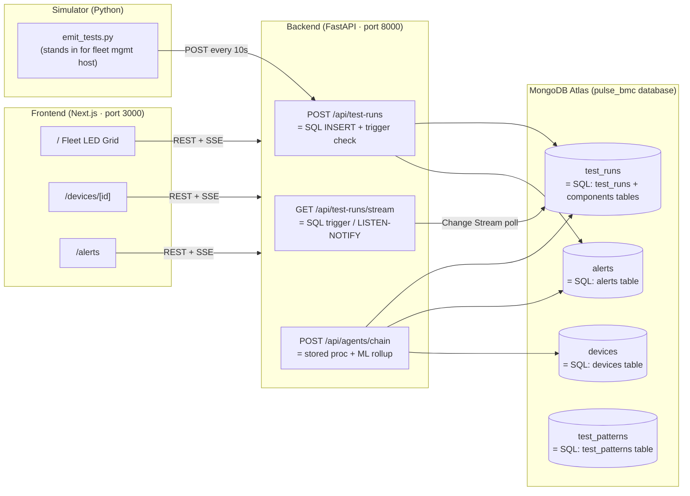

# Architecture — PulseBMC POC

## Scope

- **Use case:** BMC hardware health monitoring — demonstrates MongoDB Atlas as the cloud aggregation layer for edge in-system test data, with real-time dashboarding and AI-assisted failure prediction / work order generation.
- **Workload:** Write-heavy ingest (simulator pushes ~1 test run/device/10s), read-heavy dashboard (3s polling + SSE), bursty on demo scenarios. ~20 devices × ~360 runs/hour = ~7,200 docs/hour at peak.
- **Audience:** Hardware solutions architect — **fluent in SQL/relational databases, visual learner, minimal MongoDB exposure**. All UI surfaces must anchor MongoDB concepts to SQL equivalents. Prefer diagrams and annotated visuals over prose at every layer.

## Component Map

| Component | Technology | Responsibility |
|-----------|-----------|----------------|
| Primary data store | **MongoDB Atlas M0** (database: `pulse_bmc`) | CRUD + aggregation on devices, test_runs, alerts, test_patterns |
| Async driver | **Motor** (PyMongo async) | Non-blocking Atlas I/O from FastAPI |
| API layer | **FastAPI** + Uvicorn | REST endpoints + SSE stream; alert threshold evaluation |
| AI agents | **LangChain** + gpt-4o-mini | Three-stage: failure prediction → root cause → work order |
| Demo UI | **Next.js 14** + Tailwind + Recharts | Fleet LED grid, device detail, alerts, SQL-bridge concept panels |
| Simulator | Python script (`emit_tests.py`) | Emulates fleet management host forwarding edge data to Atlas |
| Seed script | Python script (`seed_data.py`) | Bootstraps 20 devices + 3 test patterns + 48h historical runs |

## Page Layout

| Page | Route | Key visual components |
|------|-------|-----------------------|
| Fleet overview | `/` | LED grid, ConceptBar (SQL↔MongoDB strip), Atlas connection badge |
| Device detail | `/devices/[id]` | 16×16 core LED grid, TelemetryChart, DocumentViewer panel, SSE pulse label |
| Alerts | `/alerts` | AlertCard list, "Run AI Analysis" button, WorkOrderCard + RootCauseCard output |

## Non-MongoDB Dependencies

| Dependency | Why needed | Decision |
|------------|------------|----------|
| Next.js 14 + Tailwind | Visual SPA with App Router | App Router needed for SSE; Tailwind for LED/grid animations |
| Recharts | Telemetry timeline | Lightest React charting lib with SSR-safe rendering |
| FastAPI + Uvicorn | Async Python API | Motor requires async context; FastAPI has built-in SSE/EventSourceResponse |
| LangChain + openai | Agent orchestration | Tool-calling + `with_structured_output` for typed agent responses |
| python-dotenv | Env var loading | Keep ATLAS_URI and OPENAI_API_KEY out of code |

## Diagram

## Trade-Offs

- **Embedded vs. referenced components:** `test_runs.results.components[]` is embedded (not a separate collection) because component results are always read with their parent run — eliminates a JOIN. This is a key demo talking point vs. SQL's normalized approach.
- **SSE vs. WebSocket:** SSE chosen because it's unidirectional (server → client), works through standard HTTP, and FastAPI supports it natively — no additional infrastructure.
- **Motor async client:** Single client instance per process reused across requests (module-level singleton in `db.py`) — avoids connection pool exhaustion common in serverless-style handlers.
- **gpt-4o-mini for agents:** Cost-optimised for a demo; swap to gpt-4o if latency/quality of agent chain needs improvement.

## Hard Gate Approval

- **Approval:** Plan approved — implement as specified (2026-05-29)
- **Logged in `gates.md`:** Pending
