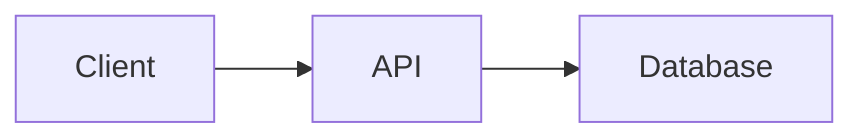

# [Project Name]

One sentence describing what this project does and who it's for.

## What it demonstrates

| Feature | Technology |
|---------|-----------|
| <!-- e.g. CRUD + aggregations --> | <!-- e.g. MongoDB Atlas Cluster --> |
| <!-- e.g. Full-text search --> | <!-- e.g. Atlas Search --> |
| <!-- e.g. Real-time feed --> | <!-- e.g. Change Streams + SSE --> |

## Stack

- **[Framework]** — e.g. Next.js 15 (App Router)
- **[UI]** — e.g. React + Tailwind
- **[Database]** — e.g. MongoDB Atlas
- <!-- add or remove as needed -->

## Architecture



## Setup

1. **Clone and install**

   ```bash
   git clone <repo-url>
   cd <project>
   npm install
   ```

2. **Configure environment**

   ```bash
   cp .env.example .env
   # Fill in required values
   ```

3. **Run the app**

   ```bash
   npm run dev
   ```

## Scripts

| Command | What it does |
|---------|-------------|
| `npm run dev` | Start dev server |
| `npm run build` | Production build |
| `npm test` | Run tests |
| <!-- add project-specific scripts --> | |

## Agent setup (Cursor)

`.cursor/rules/karpathy-guidelines.mdc` is set to `alwaysApply: true`, enforcing four principles in every session: Think Before Coding, Simplicity First, Surgical Changes, Goal-Driven Execution.

`CLAUDE.md` mirrors the same guidelines for Claude Code and other tools that read a root instruction file.

Add project-specific conventions under the **Project-Specific Guidelines** section in `CLAUDE.md` as the codebase grows.
