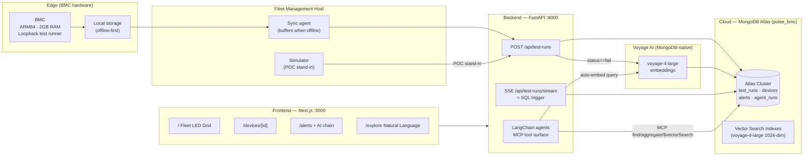

# PulseBMC

Hardware health monitoring POC for BMC fleets — powered by MongoDB Atlas, Voyage AI, and LangChain.

Built for a hardware solutions architect who needs to see the MongoDB Atlas value proposition for edge/embedded test data aggregated to the cloud.

---

## Why MongoDB?

Five talking points for your internal pitch:

| # | The pitch | Why it matters here |
|---|-----------|---------------------|
| 1 | **Sub-10ms reads via compound indexes** | Run loopback tests more often — steal idle BMC cycles. No DB latency blocking the test scheduler. |
| 2 | **Document model eliminates JOINs** | Component results are embedded inside each `test_run` document. In SQL: 3 tables + 2 JOINs. In MongoDB: one read, zero joins. |
| 3 | **Voyage AI is MongoDB-native** (acquired 2025) | Single vendor. Embeddings live next to source data. No separate embedding service, no ETL. |
| 4 | **Atlas Vector Search runs inside the same cluster** | No Pinecone. No Weaviate. No data movement. Semantic search over hardware telemetry — same cluster, same indexes. |
| 5 | **MongoDB MCP is the standardized AI agent tool surface** | `find`, `aggregate`, `$vectorSearch` in one call. Any LLM framework works. Future-proof as MCP becomes the standard. |

---

## What This POC Demonstrates

```
BMC loopback test → POST /api/test-runs → Atlas test_runs collection
                                         → LED state updates live (SSE)
                                         → Failure rate threshold check
                                         → Voyage AI embedding (background)
                                         → Alert fired if >10% failure rate
                                         → AI agent chain: predict → root cause → work order
                                         → Atlas Vector Search retrieves similar past failures
```

**This POC simulates the upstream view** — the simulator acts as the fleet management host that has already synced BMC data to Atlas. In production, BMCs persist locally and sync via the fleet management host when network is available.

---

## Architecture



---

## Data Model — MongoDB vs SQL

```
MongoDB (pulse_bmc database)          SQL equivalent
─────────────────────────────────     ──────────────────────────────────
Collection: test_runs                 Table: test_runs
  _id                                   id           PRIMARY KEY
  device_id                             device_id    FK → devices.id
  pattern_id                            pattern_id   FK → test_patterns.id
  started_at                            started_at   TIMESTAMP
  status                                status       ENUM('pass','fail')
  led_state                             led_state    ENUM('green','red',...)
  duration_ms                           duration_ms  INT
  results.overall                       overall      ENUM('pass','fail')
  results.components[]  ◄── embedded   ← JOIN to test_run_components table
    .component_id                         component_id FK
    .result                               result ENUM
    .error_code                           error_code VARCHAR
    .core_results[]     ◄── embedded    ← JOIN to core_results table
  embedding             ◄── NEW        (no SQL equivalent — vector column)
  embedding_text                        (no SQL equivalent)
```

**The key difference:** In SQL, getting a full test result with all component and core data requires 3 tables and 2 JOINs. In MongoDB, it's one document — one read.

---

## SQL ↔ MongoDB Concept Reference

| MongoDB | SQL | Notes |
|---------|-----|-------|
| Database | Database / Schema | Same concept |
| Collection | Table | Schema-flexible |
| Document | Row | JSON, can be nested |
| Field | Column | Can be array or object |
| `_id` | PRIMARY KEY | Auto ObjectId |
| Embedded array | Child table + JOIN | No JOIN needed |
| `$match` | `WHERE` | Aggregation stage |
| `$group` | `GROUP BY` | Aggregation stage |
| `$sort` | `ORDER BY` | Aggregation stage |
| `$limit` | `LIMIT` | Aggregation stage |
| `$lookup` | `LEFT JOIN` | Cross-collection |
| Change Stream | Trigger / LISTEN-NOTIFY | Real-time events |
| Vector Search | (no equivalent) | Semantic similarity |
| Atlas M0 | DB server (free tier) | Managed, no infra |

---

## Setup

### Prerequisites
- Python 3.11+
- Node.js 18+
- MongoDB Atlas cluster (M0 free tier is sufficient)
- OpenAI API key
- Voyage AI API key

### One-time setup

```bash
git clone <repo>
cd PulseBMC
./setup.sh
```

Then edit `backend/.env`:
```
ATLAS_URI=mongodb+srv://...
OPENAI_API_KEY=sk-...
VOYAGE_API_KEY=pa-...
```

### Seed the database

```bash
cd backend
source .venv/bin/activate
python seed/seed_data.py
```

This creates 20 devices, 1 loopback test pattern, 48h of history, and 10 pre-embedded historical failures for the RAG demo.

### Start the stack

```bash
./start.sh
```

Opens:
- Dashboard: http://localhost:3000
- API docs: http://localhost:8000/docs

---

## Scripts Reference

| Script | Purpose | Key flags |
|--------|---------|-----------|
| `./setup.sh` | One-time install (venv + npm) | — |
| `./start.sh` | Start all 3 processes | — |
| `python seed/seed_data.py` | Bootstrap Atlas data + embeddings | `--dry-run`, `--clear` |
| `python simulator/emit_tests.py` | Run live loopback simulator | `--burst-failure DEVICE_ID`, `--offline-buffer-sim`, `--interval N` |

---

## Demo Script (7 scenarios)

### Scenario 1 — Happy path (2 min)
> "Here's a fleet of 20 BMC devices running loopback health tests every 10 seconds."
1. Open http://localhost:3000 — show 20 green chips with rack coordinates
2. Click the **Guided Tour** button for a 4-step operational walkthrough
3. Point out amber chips flashing as tests run, then returning to green

### Scenario 2 — Inspect a device (1 min)
> "Click any chip to inspect without leaving the fleet view."
1. Click any green chip — the slide-over drawer opens on the right
2. Show: component health grid, last 10 run history, NVMe SMART telemetry, rack location
3. Right-click any chip to show the context menu (Rerun, View History, Isolate)

### Scenario 3 — Trigger a failure (1 min)
> "Watch what happens when a device fails."
1. Scroll to **Demo Controls** (expand the toggle at the bottom of the page)
2. Click **Trigger Burst Failure — Device 15**
3. Chip 15 turns red in ~3s; right-click it → Rerun to trigger a manual recheck

### Scenario 4 — Trending failure + alert (2 min)
> "MongoDB evaluates threshold rules on every insert — no cron job."
1. Click **Trigger Trending Failure — Device 7**
2. Watch the failure rate climb → alert fires when it crosses 10%
3. Navigate to `/alerts` — the alert is already there, auto-created by the `$group` aggregation

### Scenario 5 — Full AI agent chain (3 min)
> "Three stages: predict → root cause grounded in real telemetry → physical work order."
1. On the alerts page, click **Run AI Analysis** on the Device 7 alert
2. Watch the three-stage chain run (~15-30s)
3. Expand the accordion: show `RootCauseCard` — note temperature + upstream fault context in the analysis
4. Show `WorkOrderCard` — repair steps reference the physical rack location (datacenter › rack › slot)

### Scenario 6 — RAG money shot (2 min)
> "The AI found these failures in Atlas Vector Search — semantically similar even with different error codes."
1. After the agent chain runs, open the **Atlas Vector Search retrieved N similar past failures** panel
2. Show the similarity scores (>0.90 for the pre-seeded PCIe failures)
3. "Voyage AI embeddings, MongoDB Atlas Vector Search, all in one cluster — no Pinecone, no ETL"

### Scenario 7 — Explorer (open-ended)
> "Now you drive. Ask anything about the fleet data."
1. Navigate to `/explore`
2. Click the starter chip: "Which device has the highest failure rate?"
3. Show the result table + the MongoDB pipeline + SQL equivalent below it
4. Try: "Show me devices with media errors in their NVMe SMART data"

---

## Build Phasing

**June checkpoint (this build):** Full working POC — simulator, dashboard, 3-stage AI chain with RAG.

**Post-June roadmap:**
- Cross-device pattern detection (`find_fleet_wide_pattern` tool)
- MongoDB MCP server as the agent tool surface (replaces direct Motor calls)
- Aaron's real hardware schema substituted for simulated schema
- Full edge AI stack: BMC local storage → fleet management host → Atlas

---

## Schema Dependency Note

> The data model was built from the spec document. Before the June demo, validate against Aaron's real test output and update `backend/app/models/` and `backend/seed/seed_data.py` accordingly.

---

## Project Structure

```
PulseBMC/
├── backend/
│   ├── app/
│   │   ├── main.py              # FastAPI entry + lifespan
│   │   ├── db.py                # Motor client + indexes (regular + vector)
│   │   ├── models/              # Pydantic schemas
│   │   ├── routes/              # API endpoints
│   │   ├── agents/              # LangChain agents + MCP client
│   │   ├── tools/               # find_similar_failures ($vectorSearch RAG)
│   │   └── services/            # Voyage AI embedding service
│   ├── simulator/               # emit_tests.py + config.json
│   └── seed/                    # seed_data.py
├── frontend/
│   ├── app/                     # Next.js pages
│   └── components/              # Reusable UI components
├── setup.sh                     # One-time install
├── start.sh                     # Start all services
└── README.md
```
